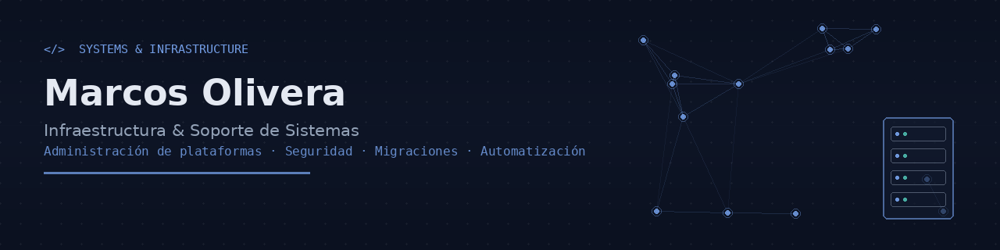

  

<h1 align="center">Infraestructura &amp; Soporte de Sistemas</h1>

  
  
  

## 👋 Sobre este repositorio

Este repositorio aloja el código fuente de mi portfolio profesional, publicado con **GitHub Pages**:

**🔗 [marcosadrianolivera.github.io/porfolio-marcos](https://marcosadrianolivera.github.io/porfolio-marcos/)**

Es un sitio estático de una sola página (HTML + CSS + JS, sin dependencias ni build step) donde detallo mi trayectoria, habilidades técnicas y proyectos destacados en administración de infraestructura y soporte de sistemas empresariales.

## 🧭 Perfil profesional

Profesional IT con más de 8 años de experiencia en la administración, configuración y seguridad de plataformas empresariales complejas. Especializado en la gestión de entornos productivos y no productivos, migraciones de gran escala, y en traducir necesidades técnicas en soluciones estables y seguras.

- 🔧 Administración de plataformas ERP, migraciones y *system copy*
- 🔐 Seguridad, gestión de roles y autorizaciones
- 🖥️ Entornos Linux / Unix / Windows
- 🗄️ Bases de datos: HANA, SQL Server, MySQL
- 🤝 Gestión de proyectos e incidencias, coordinación con equipos técnicos y de negocio

## 🛠️ Stack técnico

| Categoría | Tecnologías |
|---|---|
| Infraestructura | Linux, Unix, Windows Server, migraciones y *system copy* |
| Bases de datos | HANA, SQL Server, MySQL |
| Lenguajes | Python, SQL, VB.NET / C#, Java, JavaScript |
| Herramientas | Excel avanzado, Jira, Trello |
| Metodologías | Ágiles (Scrum/Kanban) |
| Este sitio | HTML5, CSS3, JavaScript, GitHub Pages |

## 📂 Contenido del portfolio

El sitio publicado incluye:

- Resumen profesional y trayectoria
- Experiencia por empresa/proyecto
- Habilidades técnicas
- Proyectos destacados, con documentación de soporte

## 📬 Contacto

- ✉️ olivera.marcos@outlook.com
- 📍 Buenos Aires, Argentina
- 🔗 [Ver portfolio completo](https://marcosadrianolivera.github.io/porfolio-marcos/)

---

© 2026 Marcos Olivera — Este repositorio contiene únicamente el código del sitio publicado con GitHub Pages.

